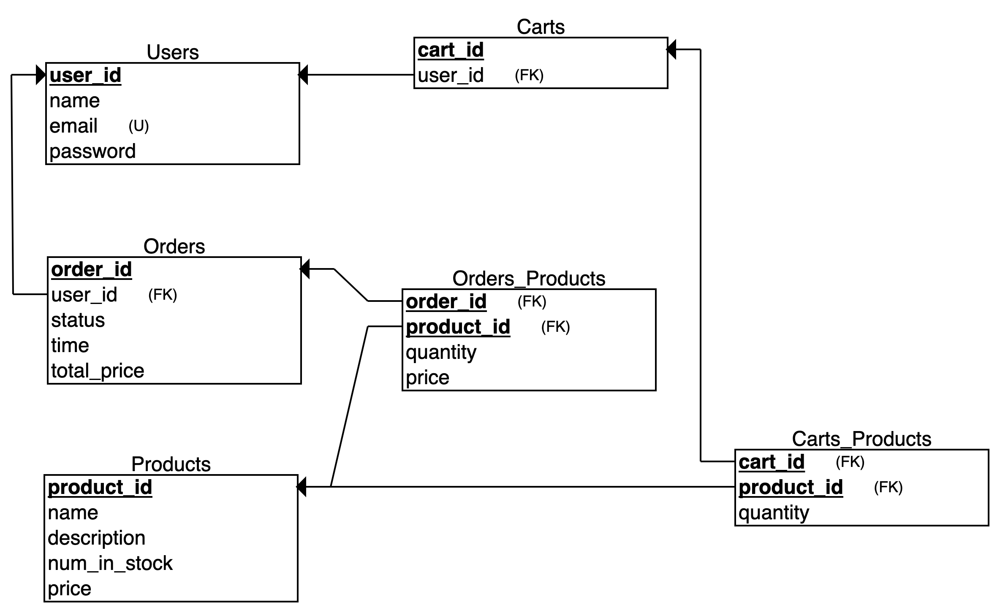

# E-Commerce REST API

## Description
The brief was this project was to build an E-Commerce REST API that allows users to perform various CRUD operations. I was tasked with this as part of the Full Stack Codecademy course.

### Project Objectives:
- Build a functioning e-commerce REST API using Express, Node.js, and Postgres
- Allow users to register and log in via the API
- Allow CRUD operations on products
- Allow CRUD operations on user accounts
- Allow CRUD operations on user carts
- Allow a user to place an order
- Allow CRUD operations on orders
- Use Git version control
- Use command line
- Develop locally on your computer
- Document the API using Swagger

## Technologies
- Postgres
- Express.js
- Node

## Dependencies
- Express
- Express Flash
- Passport
- Passport-local
- bcrypt
- pg
- ejs
- swagger-jsdoc
- swagger-ui-express

## Routes
| Route |  Method   |  Description   |
| :-----: | :---: | :---: |
| /users/register |  POST  |  Allows users to register in the database  |
| /users/login |  POST  |  Allows users to log in  |
| /products |  GET  |  Gets all products  |
| /products/{productId} |  GET  |  Gets product by ID  |
| /cart |  POST  |  Adds product to cart  |
| /cart |  DELETE  |  Deletes cart item  |
| /cart/{userId} |  GET  |  Returns user associated with cart  |
| /cart/{userId} |  POST  |  Creates cart  |
| /orders/{userId} |  GET  |  Returns a user's orders  |
| /orders/{userId}/{orderId} |  GET  |  Returns single order by ID  |
| /orders/products/{orderId} |  GET  |  Returns order with product details  |

## ERD Schema

## Development
### Resources
As this was my first project that used a combination of Postgres, Express, Express Passport and Node, I made use of various resources to implement it.
- Routing setup was learned from here: https://www.youtube.com/watch?v=DihOP19LQdg
  - Set up server.js, routes.js, controller.js, queries.js, db.js
  - Set up ecommerce_api database and tables
  - Endpoints were geared towards 'customers' postgres table
  - Some of this setup didn't work with user authentication, including anything that used 'customers' table
- User authentication was learned from here: https://www.youtube.com/watch?v=vxu1RrR0vbw
  - Established 'views' folder with HTML pages for user authentication
  - Set up 'users' table in Postgres
  - Set up user registration

### Testing
- Server side testing and database management was done with Postbird
- Postman was used for testing our API routes, request body(s) and responses.